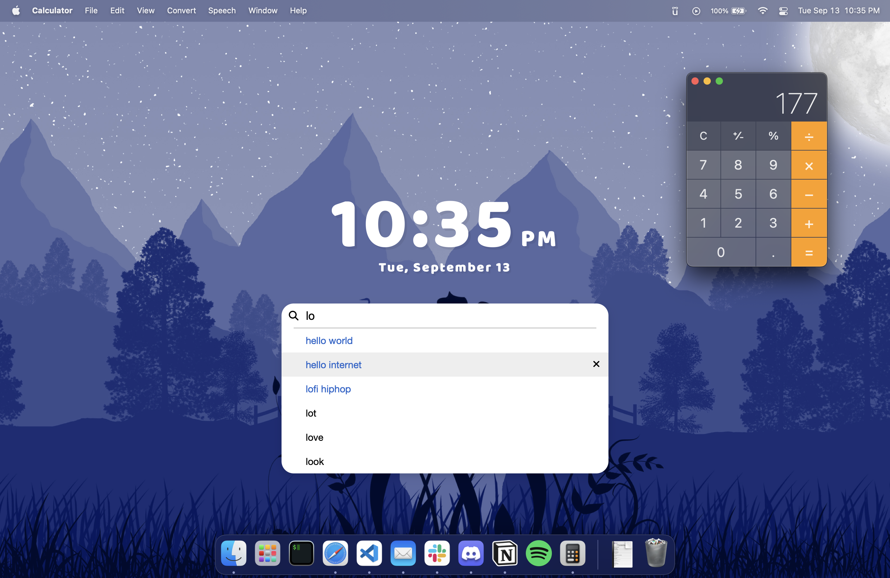

# Home Base

An aesthetically pleasing [Übersicht](http://tracesof.net/uebersicht/) widget that shows the datetime and a web search bar (e.g. defaults to Google).

Built for OSX (MacOS).

## Installation

1. Install and run [Übersicht](http://tracesof.net/uebersicht/).
2. In the menu bar, under the Übersicht icon, click **Open Widgets Folder**.
3. Move `/home-base.widget` into the Übersicht widgets folder.
4. (Optional) In the menu bar, under the Übersicht icon, click **Preferences...** and check **Launch Übersicht when I login**.
